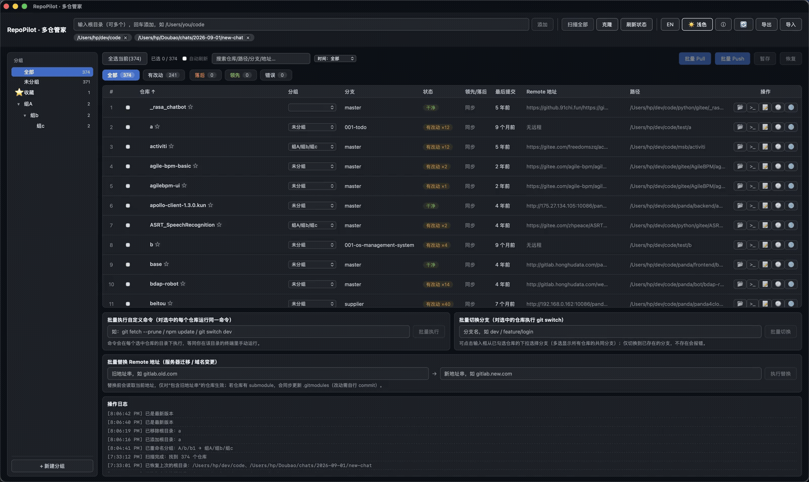

# RepoPilot · 本地多仓库批量管理工具

一个面向开发者、本地优先的多 Git 仓库批量管理桌面工具（Tauri 2 + Vue 3 + TypeScript）。适合同时维护几十个仓库、被 pull/push 烦到的人。

## 界面



## 功能

### 仓库总览
- **多根目录扫描**：扫描本地多个根目录下所有 Git 仓库，自动识别嵌套仓库（子仓库树形展开、子仓库数量徽标与脏状态汇总 ⚠）；Rust 并行遍历 + 多根目录并行扫描，跳过 node_modules/target/Pods 等重型目录，扫描日志含耗时
- **分组侧栏可折叠**：侧栏右上角 ◀ 一键收起/展开（记忆状态），收起后仅留一条展开按钮
- **状态展示**：当前分支、领先/落后、最后提交时间、改动文件数；"错误"状态徽标可点击查看完整错误详情（弹窗 + 复制 + 重试）
- **Windows 兼容**：仓库名提取统一兼容 `/` 与 `\` 路径分隔符
- **状态汇总卡片** + 统计口径提示（"当前显示 n / 总数"，搜索/筛选/分组生效时可见）
- **排序与层级序号**：7 列排序（名称/分支/领先落后/最后提交时间/改动数等），层级序号 1 / 1.1 / 1.1.1，横向滚动时序号与勾选列固定

### 批量操作
- **一键批量 Pull / Push**：全异步并行执行，实时进度与结果汇总，带二次确认；pull 前自动检测有未提交改动的仓库并跳过，避免与远程改动冲突
- **批量执行自定义命令**：工具栏「批量 ▾」下拉面板收纳 批量命令 / 批量切换分支 / 批量替换 Remote 三个功能（页签切换、内联展开）；「⋯」更多菜单收纳 语言 / 深色 / 检查更新 / 导出 / 导入 / 关于
- **批量切换分支**：多选仓库时按"共同分支"交集展示，保证全部切换成功；列表分支列可直接下拉切换单个仓库并即时刷新
- **Stash 管理**：右键仓库 → Stash 管理，查看 stash 列表，可新建（带备注）、恢复单个（pop）、删除单个（二次确认）；工具栏另有批量 stash / 恢复
- **分支管理**：右键仓库 → 分支管理，本地/远程分支列表，支持切换、创建、合并到当前分支、删除（二次确认）
- **标签管理**：右键仓库 → 标签管理，列出/新建/删除/推送标签到 origin
- **远程仓库管理**：右键仓库 → 远程仓库，列出/新增/修改地址/删除远程；地址两行布局完整显示（等宽字体、自动换行），改址输入框独占一行全宽；弹窗底部「编辑配置文件…」一键打开该仓库 `.git/config` 做高级编辑（如 fetch 配置、多 pushurl）
- **批量替换 Git 地址**：http ↔ https 互转，支持子仓库、自动加协议前缀

### 分组、收藏与筛选
- **左侧边栏分组树**：层级管理、空分组自动折叠、父组聚合过滤，支持重命名（子分组自动跟随改前缀）；**分组节点右键菜单**：新建子分组 / 重命名 / 删除 / 折叠展开；树标题「＋」新建分组；仓库右键「移动到分组 ▸」批量归类勾选的仓库（未勾选时移动当前仓库）；**新建/重命名每次只创建一级**（层级通过"新建子分组"逐级创建）
- **收藏**：星标收藏仓库，收藏夹快速入口
- **仓库别名**：右键菜单或双击仓库名设置别名，别名参与搜索与显示（原名悬停可见）
- **复制仓库路径**：右键仓库 → 复制路径，一键拷贝到剪贴板
- **收藏 / 搜索带出子仓库**：收藏或命中父仓库时可展开其子仓库（未命中/未收藏的浅色标记）；命中子仓库时带出父仓库容器
- **搜索 + 最后提交时间筛选**，全选当前视图

### 提交与版本控制
- **部分提交**：勾选文件提交，支持批量暂存（stash）/ 恢复，提交历史查看
- **Hunk 块级暂存**：提交弹窗 diff 按改动块拆分，每个块可单独"暂存此块"（git apply --cached），只暂存想要的改动；未跟踪新文件、已部分暂存的文件自动降级为只读查看 + 整文件处理
- **取消暂存 / 放弃改动**：提交弹窗文件列表内，已暂存文件可"取消暂存"（移出暂存区，改动保留），未暂存/未跟踪文件可"放弃"（还原或删除，带二次确认）
- **提交弹窗分区视图**：文件列表按 已暂存 / 未暂存 / 未跟踪 三区展示，一目了然（SourceTree 风格）
- **提交信息历史**：提交弹窗可一键复用最近 10 条提交信息（本地持久化）
- **提交历史可操作**：提交历史列表可查看每次提交的改动 diff，可 Cherry-pick 任意提交到当前分支（带确认）；支持按提交信息/作者/hash 搜索过滤
- **可视化分支图谱**：右键仓库 → 分支图谱，以 SVG 拓扑图展示分支结构、合并路径与提交，颜色区分轨道，当前分支高亮，悬停查看提交详情
- **改动文件查看**：提交弹窗内点击"查看改动"可展开每个文件的 diff 内容（含已暂存/未暂存，未跟踪新文件直接显示内容），再决定是否提交
- **改动文件统计**：列表显示每个仓库的改动文件数，悬停可查看改动文件清单
- **克隆新仓库**：输入 URL 自动识别仓库名，超时保护，失败自动清理

### 安全与体验
- **命令超时保护**：避免 git 交互认证挂起；401 / 认证失败给出可执行建议
- **配置导出 / 导入**：根目录、分组、收藏、别名一键备份为 JSON 文件，可随时恢复
- **主题与语言**：深色/浅色主题，中/英双语界面
- **快捷键**：⌘R 刷新 / ⌘⇧A 全选 / ⌘⇧D 深色 / ⌘P 拉取 / ⌘U 推送 / ESC 关闭当前浮层或弹窗
- **操作体验**：管理弹窗操作失败就地红字提示；分支/标签/远程/Stash 弹窗打开自动聚焦新建输入框；分支列下拉切换成功整行短暂高亮；提交弹窗左右分栏可拖动分隔条调整文件列表宽度（记住上次宽度），列表顶部内嵌搜索框可实时按文件名/路径过滤（过滤只影响显示，全选/计数/全部放弃仍作用于全部），支持 ↑/↓ 方向键切换文件并联动 diff 预览，打开时后台静默 fetch 并与远程分支比对、本地与远程都改过的文件标红色"远程已改"徽标并在列表顶部汇总可能冲突数量（刷新文件后自动重新比对，也可点"重新比对"手动触发；http 认证仓库自动弹认证窗输入用户名/密码重试，可勾选记住凭据写入 macOS 钥匙串并启用全局 osxkeychain helper；fetch 认证失败时降级用上次同步的远程状态比对并标注"按上次同步状态"），一键"刷新文件"（保留勾选，新文件默认勾选）与"放弃选中"（红色按钮，动态显示勾选中可放弃数量，二次确认，仅还原勾选文件中未暂存/未跟踪的改动）；刷新状态按钮带"刷新中…"进度并在日志记录结果（成功/失败/无仓库均有反馈），每行操作列带"⟳"可单独刷新该仓库状态（带日志反馈）；批量 pull 被跳过（有未提交改动）时先判断远程是否真有新提交：远程无新提交则提示"无需 pull"（计为成功），远程领先才列出涉及文件清单并跳过；批量 pull/push 遇认证失败弹认证窗、一次凭据重试所有失败仓库；批量操作显示实时进度，可中途取消（未开始的仓库跳过，已开始的执行完）；批量操作完成后显示"成功/失败"汇总条，有失败项时点击汇总条弹出"失败/跳过详情"：每个仓库显示失败原因 + 未提交文件清单，可一键"打开提交"或"定位仓库"、或"重试失败项"一键重新执行；操作日志可一键清空、点击单条复制
- **Dock 角标**脏仓数、操作日志持久化、右键菜单、图标与关于页

### 发布与更新
- 内置 Tauri 自动更新，发布新版本后应用内一键升级
- 已发布 v0.2.0（macOS / Windows / Linux 全平台）

> 功能路线与待办见 [ROADMAP.md](ROADMAP.md)。

## 开发

```bash
npm install          # 安装前端依赖
npm run tauri dev    # 开发模式运行
npm run tauri build  # 构建安装包（含自动更新产物）
```

## 系统要求

- macOS 12+（Apple Silicon / Intel）
- Windows 10/11（需在 Windows 机器上构建）

## License

MIT
